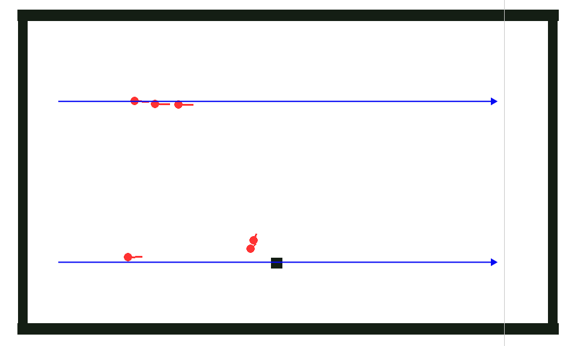
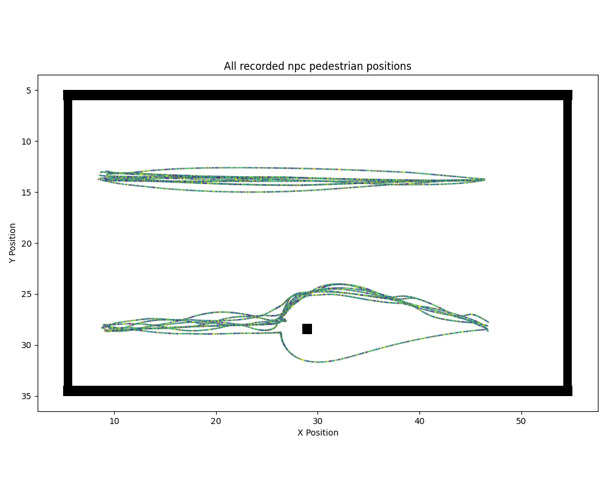
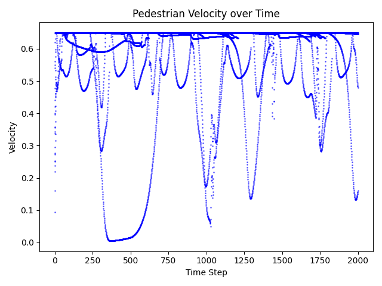
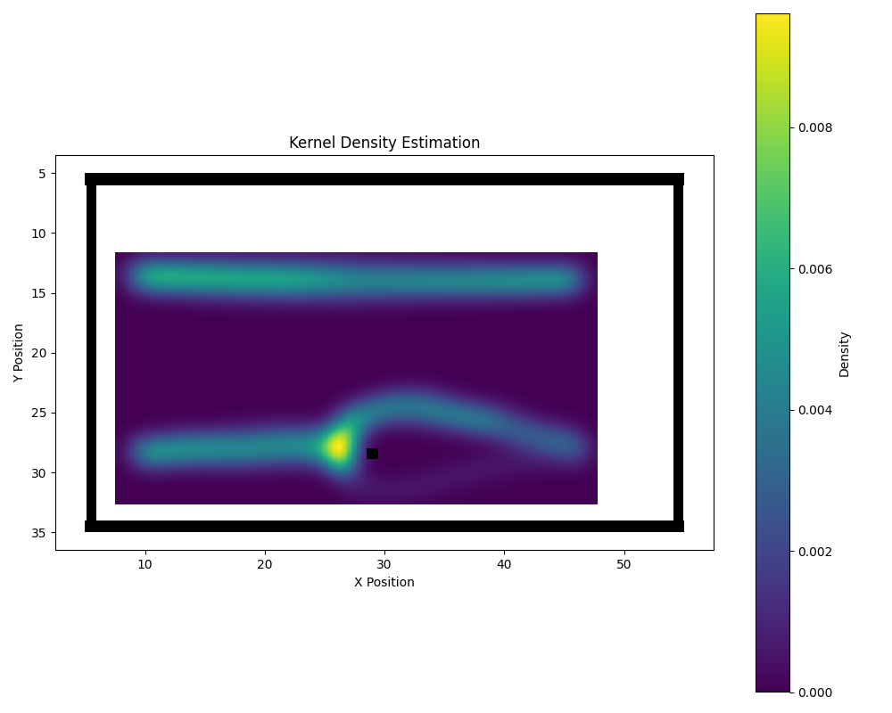
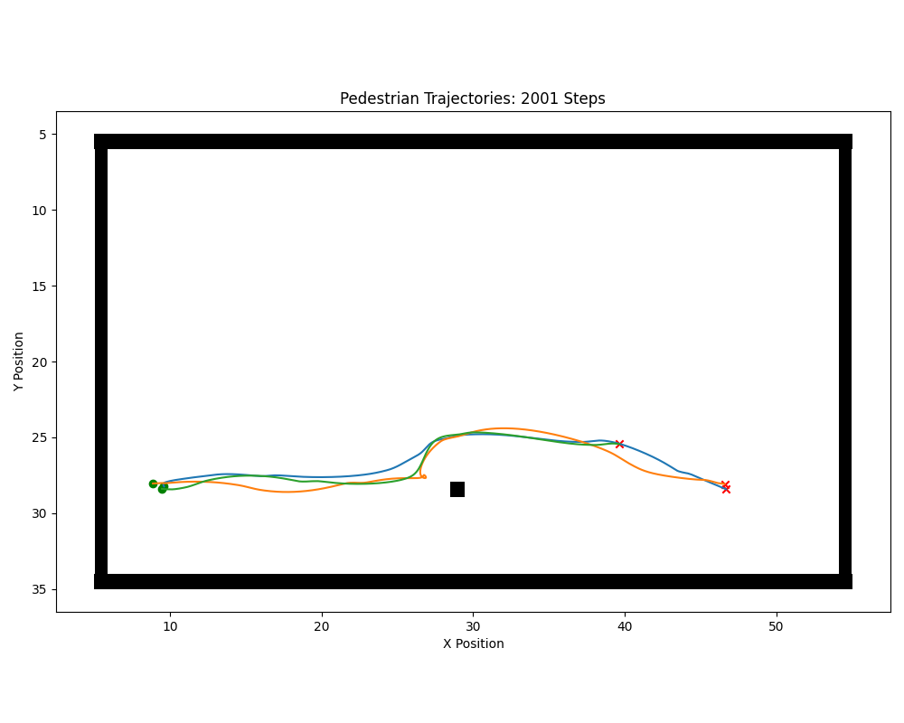
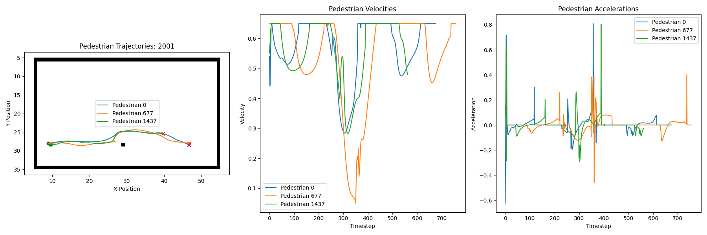
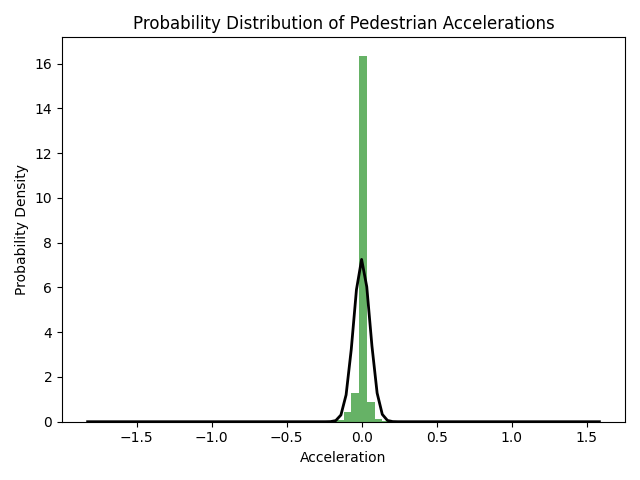
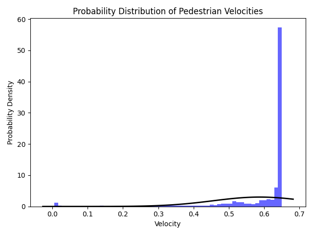
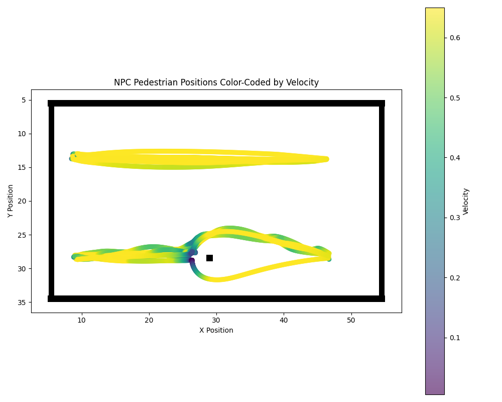
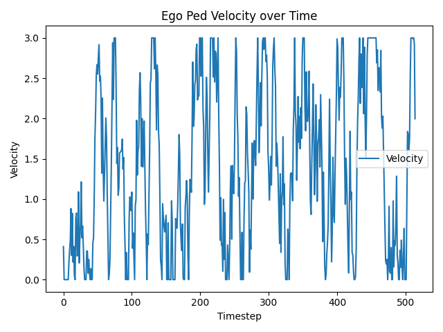

# robot-sf

## Pedestrian Metrics

Pedestrian metrics are needed to determine, if the pedestrians are moving in a realistic way.

### About

These metrics are all implemented in the data_analysis directory:  
*[plot_dataset.py](../robot_sf/data_analysis/plot_dataset.py) -> Includes base functions to plot pedestrian data*  
*[plot_kernel_density.py](../robot_sf/data_analysis/plot_kernel_density.py) -> Includes kernel density estimation functions*  
*[plot_npc_trajectory.py](../robot_sf/data_analysis/plot_npc_trajectory.py) -> Focuses more on trajectories of the npc pedestrians*  

It is possible to differentiate between single pedestrians, by observing the route taken. 
If there is a large distance between the following points, it means the pedestrian has completed 
his route and has spawned back to the start position. This newly spawned pedestrian will create his own trajectory, even though it still has the same id.

For the ego pedestrian metrics there are no explicit examples provided at the moment, because development of the ego pedestrian is not finished at the moment.

### NPC Metrics

All following metrics will be analyzed based on an example szenario.  
In this example, there are two paths from left to right.
The upper path is free, while the lower path has a small obstacle that must be passed.

**1. Plot positions of pedestrians at each time step.**  
Insight: At which positions were pedestrians located?

This plot shows that no position deviates much from the upper path, meanwhile the pedestrians on the lower path are taking a wide arc to avoid the obstacle.

**2. Calculate the speed of all pedestrians at each time step based on the provided action vector.**  
Insight: What speeds do pedestrians use?

Here you can see that the pedestrians are mostly traveling at or near maximum speed, with a few exceptions.

**3. Gaussian kernel density estimation via x-y**  
Insight: How likely is the presence of pedestrians at positions?

On the upper path, staying at one position is equally likely. The beginning is only slightly stronger due to the simulation stopping halfway.
On the lower path, it is clear to see that the probability of staying directly in front of the obstacle is significantly higher than the normal path probability. This is because pedestrians slow down before an obstacle. There is also a clear preference when selecting the alternative route.

**4. Output trajectory of one or all pedestrians**  
Insight: What Path is used by a pedestrian?

Here it is visible that the trajectories were broken off by the pedestrians on the upper path at the halfway point, as the simulation finished.
On the lower path it can be seen that one path runs underneath the obstacle and the rest runs along the top, although there are also slight differences in how the obstacle is avoided on the top route.

In this plot, a single pedestrian id is represented, which becomes three trajectories due to respawning, each with different approaches.
The blue path starts the evasive maneuver very early, while the orange pedestrian first turns in a circle in front of the obstacle.

**5. Trajectory compared to acceleration and velocity**  
Insight: What velocities are used and when does the pedestrian accelerate and decelerate?

In this plot, speed and acceleration are calculated based on the difference in position over time, rather than from the action vector.  
As you can see here, the blue and green graphs for the velocity are very similar; only a time shift is noticeable.
Orange, on the other hand, has to slow down very heavily due to the obstacle.  
The acceleration shows that spikes are used to quickly reach maximum speed again.

**6. Probability distribution over the acceleration**  
Insight: How likely is a certain acceleration for a pedestrian?

This probability distribution is fitted with a normal distribution and shows that pedestrians walk steadily most of the time, without accelerating or decelerating.

**7. Probability distribution over speed**  
Insight: How likely is a certain speed for a pedestrian?

This probability distribution is also fitted with a normal distribution and shows that pedestrians prefer maximum or near maximum speed.

**8. Speed at a certain positions**   
Insight: What is the speed at positions on the map?

This plot shows that the upper path almost always uses the maximum speed.
The lower path always slows down before the obstacle.

### Ego Metrics

**1. Velocity and acceleration**  
Insight: What speed and acceleration does the ego pedestrian use?

Example for the velocity from one testing scenario:  
The ego pedestrian can reach higher velocity (3m/s) and also changes rapidly the velocity in the current implementation. 

**2. Gaussian kernel density estimation only via x or y in comparison to ego pedestrian**  
Insight: How does the positions probabilities compare only based on one axes?

**3. Comparison of probability distributions of velocity and acceleration**  
Insight: How does the velocity and acceleration compare between ego and npc pedestrian?

